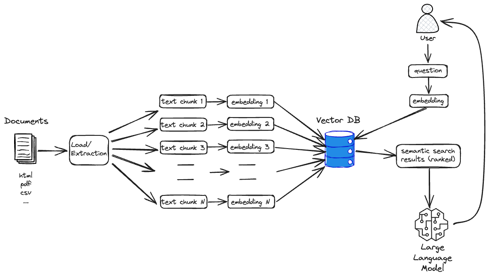

# Generative AI with RAG (retrieval augmented generation) Demo

In this demo the usage of local Large Language Models (LLM) is shown to build a Generative AI with RAG (retrieval augmented generation) solution. 



The following technologies are used:

* [Flowise](https://flowiseai.com/) - to build LLM orchestration flows
* [Chroma Vector DB](https://www.trychroma.com/) to store and search embeddings
* [Ollama](https://ollama.com/) for running LLMs
* [Redis Stack](https://redis.io/) for LLMs memory

## Creating a Platform with Platys

```bash
mkdir docker
cd docker

export PUBLIC_IP
export DOCKER_HOST_IP

cp ../config.yml .

platys gen

docker compose up -d
```

## Ollama

### Running locally

make sure that you have the `llama2` model available

```bash
ollama pull llama2
```

Check for the models

```bash
ollama list
```

### Running on docker

```bash
docker exec -ti ollama ollama list
```

## Flowise

Load the two flows

  * `webpage-load`: <webpage-load.json>
  * `webpage-ask-questions`: <webpage-ask-questions.json>

### First let's load the documents

Open the `webpage-load` flow and on the last node add the **Connect Credential**:

  * **CREDENTIAL NAME:** `chroma`
  * **Chroma Api Key:** `abc123!`


### Now let's use the chatflow

Open the `webpage-ask-questions ` flow and on the **Redis-Backed Chat Memory** node and add the **Connect Credential**:

  * click on `Redis URL`
  * **CREDENTIAL NAME:** `redis`
  * **Redis URL:** `redis://redis-stack-1:6379`

Now ask the question: `can a player asked for an incident to be reviewed by the VAR`


## Vector Admin

Add a Chroma database connection with

* **Instance URL:** `http://chroma:8000`
* **API Header & Key:** `AUTHORIZATION` & `abc123!`  